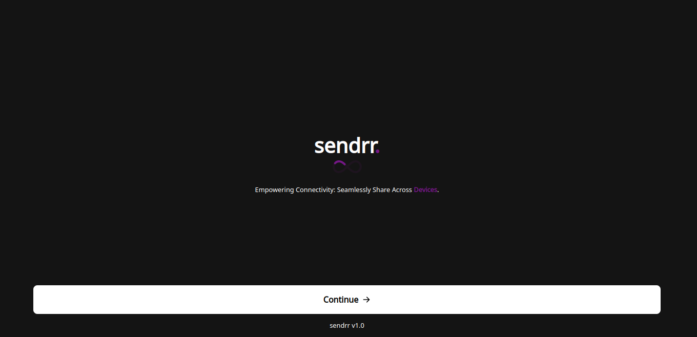

# Sendrr

## Overview

Sendrr is a powerful tool designed to alleviate the hassle of sending files and texts between devices, particularly bridging the gap between PCs and mobile phones. This real-time solution aims to streamline the transfer process, saving users valuable time and reducing the stress associated with sharing data across different platforms.

## Features

- **Real-Time Data Transfer:** Transfer data, text, and files between devices in real-time.
- **User-friendly Interface:** Intuitive and easy-to-use interface for a seamless user experience.

## Screenshots

## Getting Started

### Prerequisites

- Node.js and npm installed

### Installation

1. Clone the repository: `git clone https://github.com/DevEmmy/sendrr..git`
2. Install dependencies: `npm install`

### Usage

1. Run the application: `npm start`
2. Open the application in your web browser at `http://localhost:3000`
3. To run the backend server: `npm start` and it runs on port 3030

### Configuration
To run both the server and the client side locally, change the url in the App.jsx to `http://localhost:3030`

## Contributing

Contributions are welcome! Please follow the [contribution guidelines](CONTRIBUTING.md).

## License

This project is licensed under the MIT License - see the [LICENSE.md](LICENSE.md) file for details.

## Support

If you encounter any issues or have questions, please [create an issue](https://github.com/DevEmmy/sendrr./issues).

## Authors

- [Emmanuel Olaosebikan](https://github.com/DevEmmy)

